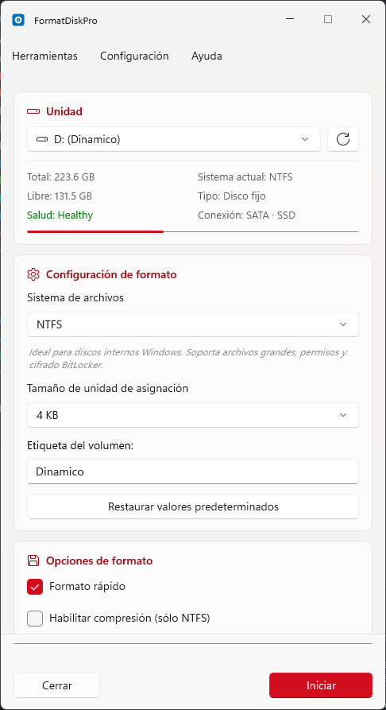
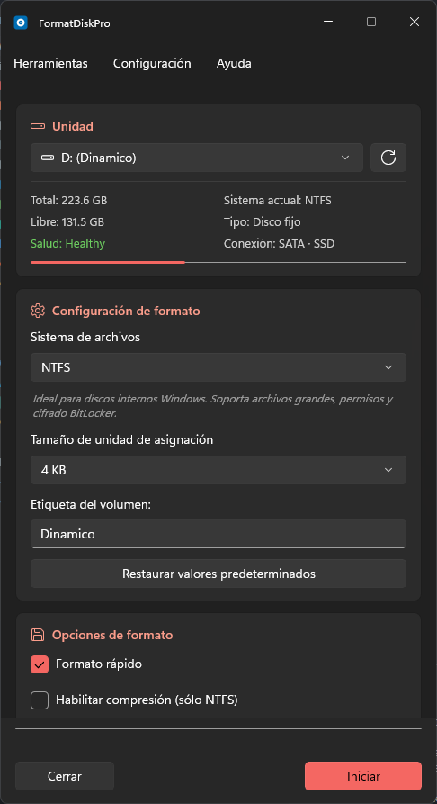
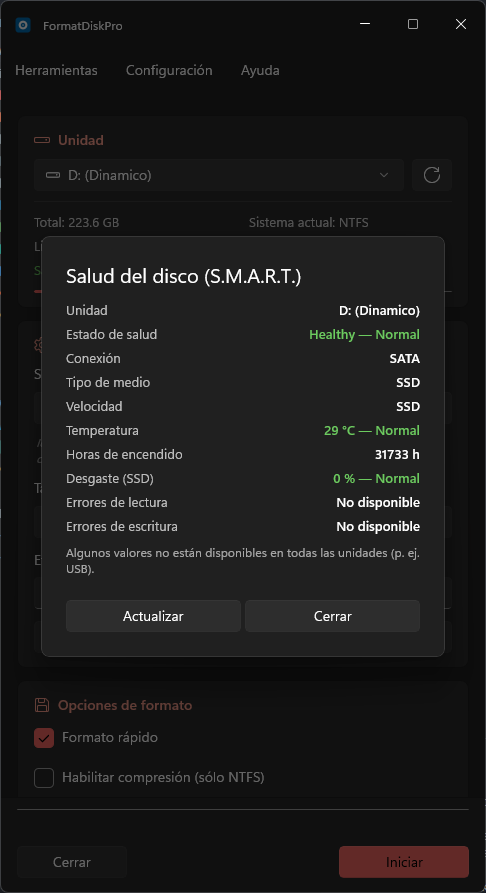

# FormatDiskPro


Herramienta de formateo y **gestión de unidades** para Windows con soporte para **5 sistemas de archivos**, diagnóstico **S.M.A.R.T. avanzado**, verificación de capacidad real, comprobación de errores (chkdsk), detección de protección de escritura, actualizaciones automáticas y protección del disco de sistema.

Inspirada en el diálogo nativo de Windows "Formatear unidad", pero ampliada hasta convertirse en una utilidad seria de gestión y diagnóstico de memorias USB y discos, con una **interfaz moderna basada en tarjetas** (WinUI 3 / Fluent Design 2).

## Capturas

| Tema claro | Tema oscuro | Salud del disco (S.M.A.R.T.) |
|:---:|:---:|:---:|
|  |  |  |

> El tema sigue al de Windows en tiempo real (o se fuerza a claro/oscuro), y el color de acento es el
> que tengas configurado en el sistema. El diálogo S.M.A.R.T. **colorea cada métrica por rango**
> (verde / ámbar / rojo) y añade su estado en texto, para no depender solo del color.

## Características

### Formateo
- **5 sistemas de archivos**: NTFS, exFAT, ReFS, FAT32 y FAT
- **Sugerencia automática** según tipo y tamaño de unidad
- **Descripción contextual** de cada sistema de archivos
- **Formato rápido o completo**, con **progreso real en %** (formato completo de NTFS/FAT/FAT32)
- **Compresión NTFS** opcional
- **Borrado seguro con progreso real**: sobrescribe el espacio libre con un patrón (sobrescritor propio) mostrando **% real, velocidad (MB/s) y tiempo restante (ETA)**; **pasadas configurables (1 / 3 / 7)**, 1 por defecto (NIST 800-88: basta en discos modernos)
- **Presets** de un clic (USB universal, consola/TV, datos Windows, comprimido, borrado seguro), más **presets personalizados**: guarda tu configuración actual con un nombre, y **edítalos** (renombrar / actualizar a la config actual), **reordénalos** o elimínalos desde *Presets → Gestionar presets…*

### Seguridad
- **Protección del disco de sistema**: la unidad de Windows se marca como `[Protegido]` con todos los controles de formato deshabilitados
- **Doble guardia** del disco de sistema (al listar las unidades y de nuevo al iniciar el formateo)
- **Confirmación reforzada**: hay que escribir la letra de la unidad para confirmar el formateo
- **Validación de etiqueta de volumen** antes de la operación destructiva
- **Revalidación de disponibilidad** de la unidad al iniciar (detecta USBs extraídos)
- **Detección de protección de escritura**: si la unidad está en *solo lectura*, lo detecta al pulsar Iniciar y ofrece quitar la protección antes de formatear (evita el fallo críptico); también disponible como herramienta manual
- **Reinicializar unidad**: para USB con particiones raras o RAW, limpia el disco y recrea una única partición primaria formateada y usable. **Solo unidades extraíbles**, con guardas reforzadas (bloqueo del disco de sistema, verificación de que el disco físico no es el de Windows y confirmación escribiendo la letra); en discos extraíbles ≥ 32 GB permite opcionalmente crear solo una pequeña partición FAT32 (tamaño elegible: 1/2/4/8/16/32 GB) y dejar el resto sin asignar (por ejemplo, para actualizar el BIOS/UEFI de una placa base desde un USB grande, ya que Windows nunca permite un volumen FAT32 mayor de 32 GB)

### Diagnóstico
- **Panel de información**: tamaño, espacio libre, FS actual y tipo
- **Salud S.M.A.R.T. avanzada**: estado de salud, conexión (USB/SATA/NVMe) y tipo de medio (SSD/HDD) en el panel, más un **diálogo de detalle** con temperatura, horas de encendido, desgaste de SSD, RPM y errores de lectura/escritura (`Get-StorageReliabilityCounter`). Temperatura, desgaste y errores se **colorean por rango** (verde/ámbar/rojo) con texto de estado (Normal/Atención/Crítico) y un botón **Actualizar**
- **Verificación de capacidad real**: detecta memorias USB falsificadas escribiendo y releyendo un patrón
- **Comprobación de errores (chkdsk)**: *Solo comprobar* (solo lectura, universal) o *Comprobar y reparar* (`/f`), con progreso en vivo y resultado claro
- **Benchmark de lectura/escritura**: mide la velocidad real (MB/s) **secuencial** (cola Q8) y **4 KiB aleatorio** (con **IOPS** junto a los MB/s, estilo CrystalDiskMark) con un archivo temporal de ~512 MB **sin caché del sistema**, tomando la mediana de varias pasadas; **no destructivo** y disponible en cualquier unidad

### Experiencia
- **Interfaz moderna basada en tarjetas** (WinUI 3 / Fluent): secciones con encabezado e icono, barra de acción inferior y un **color de acento que sigue el de Windows** (sistema de diseño inspirado en Win11Debloat), adaptándose a tema claro u oscuro
- **Interfaz multilingüe** Español · Inglés · Português · Français · Italiano (conmutable en caliente); **detecta el idioma del sistema en el primer arranque** (luego manda tu elección)
- **Tema automático / claro / oscuro**: sigue el tema del sistema Windows en tiempo real; opción de forzar claro u oscuro desde el menú
- **Recuerda tus preferencias** (idioma, tema, última unidad, presets, aviso y pasadas de borrado seguro) entre sesiones (`%AppData%\FormatDiskPro\settings.json`)
- **Expulsión segura** de unidades removibles
- **Visor de historial integrado** dentro de la app (con **búsqueda y filtros** por categoría/resultado, y **exportación a CSV**), además del registro de auditoría en `%AppData%\FormatDiskPro\history.log`
- **Lista de unidades autorefrescada**: se actualiza sola al **conectar o desconectar** una unidad (además del botón Refrescar / F5)
- **Tiempo transcurrido, velocidad y ETA** en operaciones largas, con **cancelación segura** de cualquier operación
- **Aviso al terminar**: sonido + parpadeo de la barra de tareas al completar operaciones largas (solo si la ventana no está en primer plano), para poder alejarte del PC; se activa/desactiva en *Configuración → Avisar al terminar*
- **Actualizaciones integradas**: comprueba GitHub Releases al inicio y bajo demanda; el aviso *"Actualización disponible"* muestra el **changelog** de la nueva versión antes de descargar e instalar
- **Diálogo de novedades**: tras actualizar, muestra automáticamente (una sola vez) las novedades de la nueva versión —las mismas notas publicadas en GitHub Releases—; también disponible en cualquier momento desde *Ayuda → Novedades…*
- **Icono propio** de aplicación

> 📋 Consulta la **[hoja de ruta](ROADMAP.md)** para ver las características implementadas y las próximas (organizadas por *tiers*).

## Requisitos

| Requisito | Versión mínima |
|-----------|----------------|
| Windows | 10 / 11 (x64) |
| .NET | 10.0 — *solo para compilar desde código; el instalador lo incluye* |
| Privilegios | Administrador (UAC requerido) |

## Instalación

Descarga el instalador más reciente desde la página de **[Releases](https://github.com/xfiberex/FormatDiskPro/releases)** (`FormatDiskPro-x.y.z-setup.exe`) y ejecútalo. El instalador es *self-contained*: **no requiere instalar .NET** por separado.

### Actualizaciones

La aplicación comprueba si hay una versión más reciente en GitHub Releases al iniciarse y mediante **Ayuda → Buscar actualizaciones…**. Si hay una nueva versión, ofrece descargar e instalar el nuevo instalador automáticamente (actualización silenciosa con relanzado desde la 1.2.2 en adelante).

> **Modelo de confianza (desde la v1.15.0).** El instalador se ejecuta **con permisos de administrador**, así que antes de lanzarlo la app comprueba que es el que publicó el proyecto:
>
> 1. Si lleva una **firma Authenticode** válida y de confianza para Windows, se acepta (es la garantía más fuerte, porque la avala una CA).
> 2. Si no —hoy los instaladores se publican **sin firmar**, ver más abajo—, se calcula su **SHA-256** y se compara con el que se publica como asset del release (`FormatDiskPro-x.y.z-setup.exe.sha256`).
>
> Si no supera ninguna de las dos, **el instalador se borra y no se ejecuta nada**.
>
> **Alcance honesto:** el instalador y su hash salen del mismo release, así que esto detecta un archivo **corrupto o manipulado en tránsito**, pero no protegería frente a un compromiso de la cuenta de GitHub (quien pudiera sustituir el `.exe` podría sustituir también el hash). Es el compromiso habitual de un proyecto sin certificado, y es exactamente la garantía que sustituye a la firma. La firma Authenticode —que además eliminaría el aviso de SmartScreen— sigue disponible como **opción** del flujo de publicación (ver [Construcción](#construcción)), pero no se aplica a los binarios publicados por decisión del proyecto.

## Construcción

```bash
dotnet build -c Release
```

El ejecutable queda en `src\FormatDiskPro\bin\Release\net10.0-windows10.0.19041.0\win-x64\FormatDiskPro.exe`.

### Generar el instalador

Requiere [Inno Setup 6](https://jrsoftware.org/isinfo.php) (`winget install JRSoftware.InnoSetup`):

```powershell
src\FormatDiskPro\installer\build-installer.ps1
```

Publica la app *self-contained* (win-x64) y compila el instalador en `src\FormatDiskPro\installer\Output\`, junto con su **`.sha256`** (el hash con el que la app verifica la descarga al auto-actualizarse). El instalador limpia la instalación previa antes de copiar y, en una actualización in-place, cierra y relanza la app automáticamente.

> La publicación intermedia va a `%TEMP%\FormatDiskPro-publish`, no dentro del repo: Inno Setup no maneja rutas de más de 260 caracteres, y los nombres de archivo del Windows App SDK *self-contained* se pasan del límite en cuanto el repositorio no cuelga de una carpeta corta.

**Firma de código (opcional, recomendada):** sin firma, SmartScreen muestra "editor desconocido". Si tienes un certificado, fírmalo pasando la huella o un `.pfx`:

```powershell
# Certificado del almacén de Windows (por huella SHA-1):
src\FormatDiskPro\installer\build-installer.ps1 -CertThumbprint A1B2C3...
# O un archivo .pfx:
src\FormatDiskPro\installer\build-installer.ps1 -CertFile cert.pfx -CertPassword ****
```

Firma el ejecutable publicado y el instalador (sellado de tiempo RFC3161). Requiere `signtool.exe` (Windows SDK).

¿Sin certificado? El script `installer\new-selfsigned-cert.ps1` genera uno **autofirmado** de prueba y muestra su huella:

```powershell
src\FormatDiskPro\installer\new-selfsigned-cert.ps1          # crea el cert y muestra el thumbprint
src\FormatDiskPro\installer\new-selfsigned-cert.ps1 -Trust   # (como admin) además lo hace de confianza en este equipo
```

> ⚠️ Un certificado autofirmado **no** elimina los avisos de SmartScreen para usuarios finales (su cadena no es de confianza). Sirve para validar el pipeline o para entornos controlados. Para distribución pública usa un certificado **OV/EV** de una CA reconocida.

### Publicar una versión

El script `release.ps1` (raíz del repo) corta una versión completa en un paso: valida, ejecuta las pruebas, actualiza `<Version>`, compila el instalador, hace commit + tag, lo sube y crea el **GitHub Release** con el instalador y su **`.sha256`** adjuntos.

> ⚠️ El asset `.sha256` es **obligatorio** mientras se publique sin firmar: es con lo que la app verifica la descarga antes de ejecutarla como administrador. `release.ps1` aborta si no lo encuentra.

```powershell
.\release.ps1 -Version 1.7.0           # release completo
.\release.ps1 -Version 1.7.0 -DryRun   # muestra el plan sin modificar nada
.\release.ps1 -Version 1.7.0 -CertThumbprint A1B2C3...   # firmando el instalador
```

Flags: `-DryRun`, `-SkipTests`, `-AllowDirty`, `-NotesFile <archivo.md>`, y los de firma (`-CertThumbprint` / `-CertFile` / `-CertPassword` / `-TimestampUrl`, reenviados a `build-installer.ps1`). Los usuarios con una versión anterior recibirán el aviso de actualización automáticamente.

### Regenerar las capturas del README

Las capturas de arriba **no se hacen a mano**: las genera un script que conduce la app real por UI
Automation (fija tema, idioma y unidad, abre el diálogo S.M.A.R.T. y fotografía la ventana).

```powershell
.\tools\capture-screenshots.ps1                          # claro + oscuro + S.M.A.R.T.
.\tools\capture-screenshots.ps1 -Theme dark -Language en -Drive H
```

Requiere **terminal elevada** (la app es `requireAdministrator`) y una sesión de escritorio sin nada
encima de la ventana. Respalda y restaura tu `settings.json` real, así que no altera tu configuración.

### Pruebas

```bash
dotnet test                                   # unitarias (xUnit)
```

Los **UI tests** (FlaUI/UIA3) conducen la app real y **no están en la solución**: se lanzan aparte, desde
una **terminal elevada**.

```powershell
dotnet test tests\FormatDiskPro.UiTests --filter "Category!=Slow"
```

Los que necesitan la USB física de pruebas **se omiten solos** si no está conectada (omitido ≠ fallido), y
el que borra datos de verdad solo corre con `FORMATDISKPRO_ALLOW_DESTRUCTIVE=1`. Para incluirlos en un corte
de versión: `.\release.ps1 -Version X.Y.Z -UiTests`.

Las pruebas unitarias (xUnit) cubren la lógica pura aislada en `Core` y los helpers testeables de `Services`: construcción de comandos de formato, blindaje anti-inyección, parseo de progreso, longitud de etiqueta, consistencia de presets, comparación de versiones, persistencia de configuración, cálculo de velocidad/ETA, patrón y número de pasadas del borrado seguro, parseo del historial (más filtro y exportación CSV, con neutralización de fórmulas) y del detalle S.M.A.R.T. (más umbrales de severidad), **verificación del instalador descargado** (SHA-256 contra un servidor HTTP local, rechazo del hash que no coincide y del release sin hash), **contraste WCAG AA de los colores de severidad** en ambos temas, interpretación del código de salida de chkdsk, elección de estilo de partición (MBR/GPT) y parseo de la reinicialización, planificación/velocidad/IOPS del benchmark, conversión de las notas de versión (Markdown → texto plano), validación y renombrado de nombres de presets personalizados, clasificación de eventos de cambio de dispositivo, completitud de las traducciones (5 idiomas) y mapeo de códigos de idioma y de cultura del sistema, y la decisión de aviso al terminar.

## Uso

1. Ejecutar como **Administrador** (el manifiesto UAC lo solicita automáticamente)
2. Seleccionar la unidad a formatear en el desplegable (cualquiera **salvo la del sistema**, que aparece protegida)
3. Elegir sistema de archivos, tamaño de cluster y etiqueta (o aplicar un **Preset** desde el menú *Configuración*)
4. Pulsar **Iniciar**, escribir la letra de la unidad para confirmar y aceptar

> **Nota de seguridad**: el disco del sistema (donde reside Windows) aparece marcado como `[Protegido]` y todos sus controles de formato quedan deshabilitados. El resto de unidades — removibles, discos de datos fijos y discos RAM — pueden formatearse. Antes de iniciar se exige confirmar escribiendo la letra de la unidad.

### Menú

| Menú | Opciones |
|------|----------|
| **Herramientas** | Verificar capacidad real · Salud del disco (S.M.A.R.T.) · Comprobar errores (chkdsk) · Benchmark rápido · Quitar protección de escritura · Reinicializar unidad · Expulsar unidad · Ver historial |
| **Configuración** | Idioma (ES/EN/PT/FR/IT) · Tema (Automático/Claro/Oscuro) · Presets (con Gestionar presets…) · Avisar al terminar |
| **Ayuda** | Buscar actualizaciones · Novedades · Licencia · Avisos de terceros · Acerca de (con disclaimer, privacidad y *Apoyar el proyecto*) |

## Sistemas de archivos disponibles

| FS | Recomendado para | Límite de archivo |
|----|-----------------|-------------------|
| NTFS | Discos internos Windows | Sin límite práctico |
| exFAT | USB > 32 GB | Sin límite práctico |
| ReFS | Almacenamiento crítico | Sin límite práctico |
| FAT32 | USB ≤ 32 GB, consolas | 4 GB |
| FAT | Unidades < 2 GB | 2 GB |

> En discos extraíbles ≥ 32 GB, *Reinicializar unidad* permite crear solo una pequeña partición FAT32
> (1/2/4/8/16/32 GB, elegible) dejando el resto sin asignar — ver arriba.

## Arquitectura

Separación por capas (lógica pura aislada de los efectos colaterales y de la UI):

```
src/FormatDiskPro/
├─ Core/            Lógica pura y testeable
│  ├─ FormatLogic.cs        Construcción de comandos, parseo de progreso, formato de bytes
│  ├─ Throughput.cs         Velocidad y tiempo restante (ETA) de operaciones largas
│  ├─ SmartInfo.cs          Modelo + parseo del detalle S.M.A.R.T. + umbrales de severidad
│  ├─ SeverityPalette.cs    Colores verde/ámbar/rojo por tema (contraste WCAG AA verificado por tests)
│  ├─ HistoryEntry.cs       Parseo del historial + filtro y exportación a CSV (anti CSV injection)
│  ├─ ReinitPlan.cs         Estilo MBR/GPT por tamaño + parseo de la nueva letra
│  ├─ Benchmark.cs          Tamaño de prueba, velocidad e IOPS
│  ├─ ReleaseNotes.cs       Notas de versión (Markdown) → texto plano
│  ├─ DeviceChange.cs       Interpretación de WM_DEVICECHANGE (autorefresco de unidades)
│  ├─ LegalText.cs          Lectura de la licencia GPLv3 y avisos de terceros embebidos
│  ├─ UpdateChecker.cs      Comparación de versiones para actualizaciones
│  ├─ AppInfo.cs            Versión, coordenadas del repositorio y enlace de donación
│  └─ Presets.cs            Configuraciones predefinidas + validación/renombrado
├─ Services/        Efectos colaterales (procesos / disco / red)
│  ├─ DiskService.cs        S.M.A.R.T., nº de disco, protección de escritura y expulsión (PowerShell)
│  ├─ SecureWipe.cs         Borrado seguro del espacio libre (sobrescritor propio, con progreso)
│  ├─ CheckDisk.cs          Comprobación / reparación del sistema de archivos (chkdsk)
│  ├─ ReinitDrive.cs        Reinicializar disco extraíble (clean + partición + formato)
│  ├─ BenchmarkRunner.cs    Benchmark de lectura/escritura (no destructivo)
│  ├─ CapacityVerifier.cs   Verificación de capacidad real
│  ├─ AppSettings.cs        Preferencias persistentes (settings.json: idioma/tema/unidad/presets/aviso)
│  ├─ Notifier.cs           Aviso al terminar (sonido + parpadeo de barra de tareas, Win32)
│  ├─ UpdateService.cs      GitHub Releases: consulta, descarga, VERIFICACIÓN (firma/SHA-256) e instalación
│  └─ History.cs            Registro de auditoría
├─ UI/              WinUI 3 (Windows App SDK)
│  ├─ MainWindow.xaml / .cs        Ventana principal y orquestación
│  ├─ ConfirmDialog.xaml / .cs     ContentDialog — confirmación reforzada
│  ├─ HealthDialog.xaml / .cs      Diálogo de detalle S.M.A.R.T.
│  ├─ HistoryDialog.xaml / .cs     Visor de historial integrado
│  ├─ WhatsNewDialog.xaml / .cs    Novedades de la versión (tras actualizar / manual)
│  ├─ PresetsDialog.xaml / .cs     Gestionar presets propios (guardar / editar / reordenar / eliminar)
│  ├─ AboutDialog.xaml / .cs       Acerca de: descripción, disclaimer, privacidad, donación
│  ├─ LegalTextDialog.xaml / .cs   Visor de licencia GPLv3 / avisos de terceros
│  ├─ Theme/AppTheme.xaml          Tokens de diseño (tarjetas, encabezados, footer)
│  └─ DriveViewModel.cs            Modelo de binding para el ComboBox de unidades
├─ Localization/    Cadenas ES/EN/PT/FR/IT centralizadas (arreglo por idioma)
├─ installer/       Inno Setup (installer.iss + build-installer.ps1 → Output/)
└─ Program.cs       Punto de entrada

tests/FormatDiskPro.Tests/     Pruebas xUnit sobre la lógica de Core y los helpers de Services
tests/FormatDiskPro.UiTests/  Pruebas de UI con FlaUI/UIA3 sobre la app real (fuera de la solución)
tools/capture-screenshots.ps1 Regenera las capturas del README conduciendo la app por UI Automation
docs/screenshots/             Capturas del README (generadas, no editadas a mano)
ROADMAP.md                    Hoja de ruta de características (tiers)
release.ps1                   Corte de versión en un paso (build + tag + GitHub Release)
```

## Stack

- C# 13 / .NET 10
- **WinUI 3** (Windows App SDK 1.8, unpackaged) — Mica, Fluent Design 2, `ExtendsContentIntoTitleBar`, sistema de tarjetas inspirado en Win11Debloat
- `Format-Volume` / `format.com` (formateo) · sobrescritor propio (borrado seguro y benchmark) · `chkdsk` (comprobación/reparación) · `Clear-Disk` / `Initialize-Disk` / `New-Partition` (reinicializar) · `Get-PhysicalDisk` / `Get-StorageReliabilityCounter` (S.M.A.R.T.) · `Set-Disk` (protección de escritura)
- Comandos PowerShell vía `-EncodedCommand` (Base64 UTF-16LE) para evitar inyección
- UAC: `requireAdministrator` en `app.manifest`

## Licencia

Software libre distribuido bajo la **[GNU General Public License v3.0](LICENSE)** (GPLv3): puedes usarlo,
estudiarlo, modificarlo y redistribuirlo, **siempre que los derivados conserven la misma licencia y su código
fuente abierto**. Se ofrece **SIN NINGUNA GARANTÍA** (ver el aviso del programa). Las atribuciones de
componentes de terceros están en [THIRD-PARTY-NOTICES.txt](THIRD-PARTY-NOTICES.txt). La licencia y los avisos
también se pueden consultar dentro de la app en *Ayuda → Licencia* y *Ayuda → Avisos de terceros*.

> ⚠️ **Aviso de uso:** FormatDiskPro formatea y borra unidades de forma **irreversible**. Comprueba siempre la
> unidad seleccionada antes de iniciar; el autor no se hace responsable de pérdidas de datos.

## Apoyar el proyecto

FormatDiskPro es gratuito y de código abierto. Si te resulta útil, puedes **apoyar su desarrollo con una
donación voluntaria** (PayPal) desde *Ayuda → Apoyar el proyecto* dentro de la app. Las donaciones son
totalmente opcionales: **ninguna función está limitada ni de pago**.

## Privacidad

La aplicación **no recopila datos personales ni telemetría**. La única conexión a Internet es para comprobar y
descargar actualizaciones desde GitHub Releases (HTTPS).
